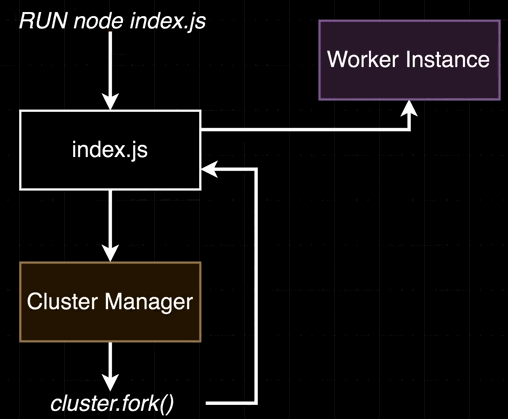
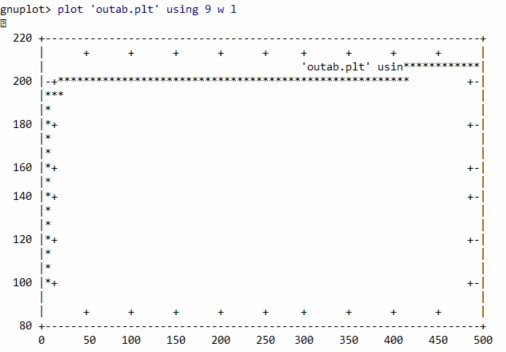
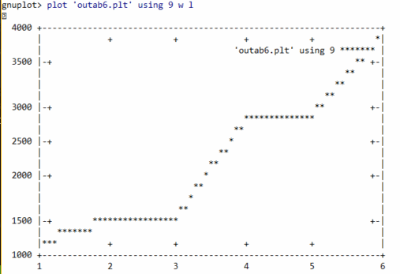
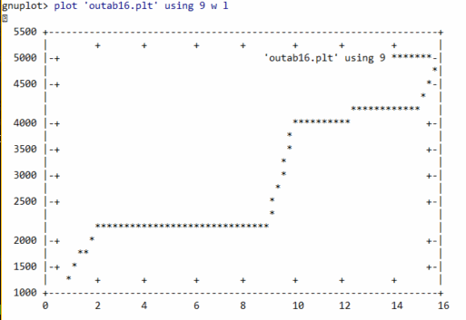
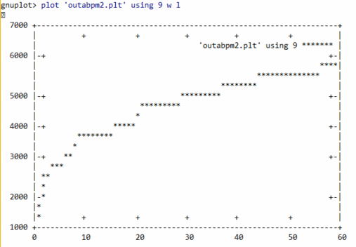

---?image=assets/images/grauman-at-wobi.png

---
# Introduction

Our Facebook Group: 
GRAUMAN- Node.Js at WOBI

WhatsApp:
https://chat.whatsapp.com/HiWZtxYZU0WF0Q9geUFxYD

Tools: 
VSCode, Browser

---

## Node.js @ Wobi

@color[#e49436](GRAUMAN) dev courses for R&D teams
https://www.grauman.co.il

---
#### @color[#e49436](Express Generator)

- Express Generator

`> npm install -g express-generator`

Install dependencies

`> npm install`

---
#### @color[#e49436](Express Env Variables)

`> npm install dotenv --save`

Create .env file in root folder and inside:

```js
PORT=4100
```
And inside package.json:

```js
"start": "nodemon -r dotenv/config ./bin/www",
"startProd": "set PORT=3100 & nodemon -r dotenv/config ./bin/www"
```

---
#### @color[#e49436](Express Env Variables)

Run the server twice:

`> npm start`

`>npm run startProd`

And see the log

---
#### @color[#e49436](Express uuid)

We need to generate random GUID strings for our sessions

`npm install uuid --save`

```js
//Show it in homepage
router.get('/', function(req, res, next) {
  res.render('index', { title: 'Express', 
            sessionID: require('uuid/v4')() });
});

```

---
#### @color[#e49436](Express Session)

`> npm install express-session --save`

- Let's add our session middleware
  - Create middleware folder
- require express-session and uuid/4
- Use session({genid, secret, resave, saveUninitialized})
  - genid should return unique string,
  - secret is env key

---
#### @color[#e49436](Express Session)

```js
session({
    genid: req => {
        console.log(`session middleware. sessionID ${req.sessionID}`);
        return uuid();
    },
    secret: sessionSecret,
    resave: false, //For Store...later
    saveUninitialized: true //...later
})
```

---
#### @color[#e49436](Express Session)

Update .env, add

```js
SESSION_SECRET="My secret session key"
```

And use it for the session secret

---
#### @color[#e49436](Express Session)

express-session will add sessionID to the request

So let's try it out

```js
//Show it in homepage
router.get('/', function(req, res, next) {
  res.render('index', { title: 'Express', 
            sessionID: req.sessionID });
});

```

Watch the cookie in browser and in server console

Try refreshing, try to delete the cookie

---
#### @color[#e49436](Express Session)

Restart the server and go to homepage again

Again, watch the cookie in browser and in server console

Have you noticed anything?

---
#### @color[#e49436](Express Session)

Sessions are stored in memory

If user sends new session cookie, our middleware can't find it

So it initiates a new one...

We need to store our sessions to survive server restarts

...More user friendly

---
#### @color[#e49436](Express Session Store)

`> npm install session-file-store --save`

Add it to our session config object (store property)

```js
const FileStore = require('session-file-store')(session);
//...
store: new FileStore(),
secret: sessionSecret,
///...

```
Try again with the browser

---
#### @color[#e49436](Express Session Store)

Did you noticed the server restarts each time a request is coming?

This is because session-store created a *sessions* folder and updates it

with the latest time the user reached the server

Help nodemon. Add to package.json

```js
nodemon --ignore sessions/
```

---
#### @color[#e49436](Express Session Store)

After a period when no interaction is made by the user

The session is ended and removed from store

```js
[session-file-store] Deleting expired sessions
[session-file-store] Deleting expired sessions

//ttl can be set when newing-up FileStore
```

---
#### @color[#e49436](Express Login)

Let's create a login route

- Create login router and hook it into express
- Add *get* and *post* routes
  - console log *req.sessionID* and *req.body*
  - render login ejs file with email and password

Run and verify post data is logged

---
#### @color[#e49436](Express Passport)

Install Passport as authentication middleware

`> npm install passport --save`

We'll be using *local* strategy (email+password)

`> npm install passport-local --save`

Or in one shot

`> npm install passport passport-local --save`

---
#### @color[#e49436](Express Passport)

Then we initialize passport

```js
app.use(passport.initialize());
app.use(passport.session());
```

And restoring session state (Later on)

---
#### @color[#e49436](Express Passport)

- We will use Passport *authenticate('local')*
  - Which will use our auth method 
  - If authenticated, Passport will give us the req.*user* object

So first, implement authentication method

LocalStrategy assumes 'email' and 'password' are sent in the request's body

---
#### @color[#e49436](Express Passport)

Local Strategy authentication method

```js
passport.use(
 new LocalStrategy({ usernameField: 'email' },
  (email, password, done) => {
     console.log(`LocalStrategy ${email} ${password}`);
     const user = //... find the user by email
     if(!user) return done(null, false);
     if(user.password !== password) return done(null, false);
     return done(null, user);
  }
 )
);

```
---
#### @color[#e49436](Express Passport)

```js
passport.authenticate('local', (err, user, info) => {
  //login will be added if authentication succeeded
  req.login(user, err => {
      //req.user and req.session.passport are available
      next();
  });
})(req, res, next);
```

After successful authentication, 

Passport will establish a persistent login session

---
#### @color[#e49436](Express Passport) authenticate

- In our strategy, we use POST data to verify the user
- If verified, we get back to *authenticate()* 
  - And Passport added *req.login()* with the *user* as argument
    - We call login with the authenticated user
    - And eventually call the *next()* middleware

---
#### @color[#e49436](Express Passport) authenticate

- *req.login* then call *passport.serializeUser(user)*:
  - It saves user id to the session store
  - It adds user id as request.session.passport
  - It adds user object as request.user

```js
passport.serializeUser((user, done) => {
    done(null, user.id);
});
//{"cookie":{..."__lastAccess":...,"passport":{"user":101787}}

```

---
#### @color[#e49436](Express Passport) authenticate

```js
passport.deserializeUser((id, done) => {
    //Find the user... then
    if(user) done(null, user);
    else done(null, false);
});
```
- *passport.deserializeUser(userid)* will be called on next requests
- It'll match session id to the session store and retrieve user id
- Leaving us the opportunity to locate back the user data
- And add it back again to the request object

---
#### @color[#e49436](Express Passport) authorization

We can now protect some routes from being accessed

Using *req.isAuthenticated()*

Or creating custom middleware

```js
router.get('/users/:name', authorize, (req, res) => {
    //...got here if authorized
    //serve the page
});

```

---
#### @color[#e49436](Express Passport) return to url

If the user is in */users/Shahar*

The session had expired

He refresh the browser

After redirecting to */login* and authenticated

Where should we redirect him to?

*/* Or back to */users/Shahar* ?

---
#### @color[#e49436](Express Passport) return to url

We can do it like so:

```js
router.get('/login', (req, res) => {
    res.render('login', {backTo: req.query.backTo ?
         `?backTo=${req.query.backTo}` : ''});
});
//And in the form
<form action="/login<%= locals.backTo %>" method="POST"></form>
//Then in the post
router.post('/', authenticate, (req, res) => {
    if(req.query.backTo) res.redirect(req.query.backTo);
    else res.redirect(`/`);
});
```

---
#### @color[#e49436](Express Passport) return to url

Or we can use our session to store the original url 

```js
function authorize(req, res, next) {
    if(!req.isAuthenticated()){
        req.session.backTo = req.originalUrl;
        res.redirect('/login');
    }else{
        next();
    }
}
router.post('/', authenticate, (req, res) => {
    if(req.session.backTo) res.redirect(req.session.backTo);
    else res.redirect(`/users/${req.user.name}`);
});
```

---
#### @color[#e49436](Express encrypt)

`>  npm install bcrypt --save`

```js
bcrypt.hash(student.password, 10)
        .then(hash => {});
//...
bcrypt.compare(password, hash)
        .then(res => res)//true/false
```

---
#### @color[#e49436](Express MySql)

Make sure you create college db with student table (id, name, email, password)

`> npm install mysql --save`

```js
this.connection = mysql.createConnection({
    host: process.env.DB_HOST,
    port: process.env.DB_PORT,
    user: process.env.DB_USER,
    password: process.env.DB_PASSWORD,
    database: process.env.DB_DATABASE
});
```

---
#### @color[#e49436](Express MySql)

Query as usual!

```js
connection.query('select * from student where email='+email, 
    (err, results, fields) => {
        if(err) throw err;
        return results.find(s => s.email === email);
});
```

Hmmm... can you think of a potential problem above?

---
#### @color[#e49436](Express MySql)

email could be *'bla; drop table student;'*

```js
connection.query('select * from student where email = ?', 
    connection.escape(email),
    //[email], //escaped as well!
    (err, results, fields) => {
        if(err) throw err;
        return results.find(s => s.email === email);
});
```

Escape everything!

---
#### @color[#e49436](Express MySql)

Escape ids

```js
connection.query(`select * from 
        ${connectoin.escape(table)}
        where id = 
        ${connection.escapeId(id)}`,
    (err, results, fields) => {})
});
//Or
connection.query('select * from ?? where id = ?', ['student', [id]], 
    (err, results, fields) => {})
});
```

---
#### @color[#e49436](Express MySql)

```js
const columns = ['id', 'name', 'email', 'password'],
      table = 'student';
const q = this.connection.query(
            `select ?? from ?? where id = ?`, 
            [columns, table, [id]], 
            (err, results, fields)=>{
                console.log('Escaping', q.sql);
            }
);
//Escaping select `id`, `name`, `email`, `password` from `student` where id = 4
```

---
#### @color[#e49436](Express MySql)

Preparing query for later use

```js
var sql = "select ?? from ?? where id = ?";
var data = [columns, table, [id]];
sql = mysql.format(sql, data);
```

---
#### @color[#e49436](Express MySql)

Piping results

```js
this.connection.query(`select...`)
    .stream({highWaterMark:1})
    .pipe(stream.Transform({
        objectMode: true,
        transform: function(object, enc, cb) {
            console.log('mysql pipe transform', object);
            cb();
        }            
        }).on('finish', () => console.log('transform ended'))
    );
```

---
#### @color[#e49436](Express REST)

Route + HTTP Verb = REST API

- GET /api/students
  - Get all students
- POST /api/students
  - Create a student
- GET /api/students/:id
  - Get a single student
- PUT /api/students/:id
  - Update a student with new data
- DELETE /api/students/:id
  - Delete a student

---
#### @color[#e49436](Clustering & Worker Threads)

Cluster mode is when Node runs in multiple copies

All are running our server inside them.

Multiple instances of the event loop

---
#### @color[#e49436](Clustering & Worker Threads)

Worker Thread is using the libuv's thread pool

Still experimental

---
#### @color[#e49436](Clustering & Worker Threads)

So let's create a simple server to test those out

```js
const express = require('express'),
      app = express();

app.get('/', (req, res) => {
    res.send('Ahalan!');
})
.listen(3100, () => console.log('Listen on 3100'));
```

---
#### @color[#e49436](Clustering & Worker Threads)

Most of our code will use built-in modules

Which are using libuv's tread pool or OS tasks

But what if we need to do intensive cpu work?

We'll block the event loop...


---
#### @color[#e49436](Clustering & Worker Threads)

We can simulate that by doing long while loop

Test your server now with 2 tabs

The event loop runs in single thread

If you have 16 cores machine, your app will use just 1

---
#### @color[#e49436](Clustering & Web Workers)

We can make a copy of our server

Which means each has it's own event loop in a dedicated process

So we can handle parallel requests *on the same port*

---
#### @color[#e49436](Clustering & Web Workers)

We will have a *Cluster Manager*

Like the parent process, the first born

The manager will create multiple instances of the server

It's responsible for monitoring the healte of each instance

---
#### @color[#e49436](Clustering & Web Workers)

*Cluster Manager*

- Start instances
- Stop instances
- Restart them
- Send them data
- ...

Administration stuff

---
#### @color[#e49436](Clustering & Web Workers)

Run `node index.js`

Will create Node Instance running our index.js server

If we *fork* our instance, we'll create a copy of index.js


---
#### @color[#e49436](Clustering & Web Workers)



---
#### @color[#e49436](Clustering & Web Workers)

```js
cluster = require('cluster');
```

We distinguish between the manager and children by checking 

```js
cluster.isMaster

isMaster === true // I'm the Master, 
isMaster === false// I'm a Worker
```

---
#### @color[#e49436](Clustering & Web Workers)

```js
const cluster = require('cluster');
//...
//Is this master mode?
if(cluster.isMaster){
    //Run app.js again in child/slave mode
    cluster.fork();
} else {
    //...
    app.listen(3100, () => console.log('Listen on 3100'));
})
```

---
#### @color[#e49436](Clustering & Web Workers)
 
forking just once isn't much of a benefit

We can fork as much as we want

Try to fork 2,3 or 4 times

Run the server and open multiple tabs

Test to see you get results as expected

---
#### @color[#e49436](Clustering & Worker Threads)

Benchmark your tests can be difficult

How would you simulate 500 requests? 1000 requests?

A simple tool is Apache Benchmark, or ab

`> ab.exe -c 10 -n 500 -g outab.plt http://localhost:3100/`

500 requests, 10 concurrents, outout to a file

---
#### @color[#e49436](Clustering & Worker Threads)

```js
starttime	seconds	    ctime	dtime	ttime	wait
Mon Oct 01 21:54:08 2018	1543694048	0	98	98	98
//...
```

- starttime − The date at which the call started
- ctime − The Connection Time
- dtime − The Processing Time
- ttime − Total Time (ctime + dtime)
- wait − Waiting Time

---
#### @color[#e49436](Clustering & Worker Threads)

Using gnuplot



---
#### @color[#e49436](Clustering & Worker Threads)

So if we have routes which takes time to process

And other faster routes,

Then clustering can kinda load-balancing incoming requests

---
#### @color[#e49436](Clustering & Worker Threads)

To better simulate real time processing

Let's use pbkdf2

Let's, for start, fork 1 child with just 1 thread

`> ab.exe -c 1 -n 1 http://localhost:3100/`

Then `> ab.exe -c 2 -n 2 http://localhost:3100/`

Make sure you understand the results

---
#### @color[#e49436](Clustering & Worker Threads)

Now test with 2 children each with 1 thread

And test with ab numbers matching your children

See how performance is degradating as you keep forking more children then available CPUs

---
#### @color[#e49436](Clustering & Worker Threads)

Forking 6 children with single thread pool

`> ab.exe -c 6 -n 6 -g outab6.plt http://localhost:3100/`




---
#### @color[#e49436](Clustering & Worker Threads)

Forking 16 children (twice than my cpus) with single thread pool

`> ab.exe -c 16 -n 16 -g outab16.plt http://localhost:3100/`




---
#### @color[#e49436](Clustering & Worker Threads)

We can ease the pain by using pm2

Production process manager for Node.js

`> npm install -g pm2`

Then

`> pm2 start app.js`

`> pm2 show <app-name>`

`> pm2 monit`

`> pm2 start app.js -i 0 --watch`


---
#### @color[#e49436](Clustering & Worker Threads)

`> pm2 start app.js -i 0`

`> ab.exe -c 10 -n 60 -g outabpm2.plt http://localhost:3100/`



---
#### @color[#e49436](Clustering & Web Workers)

Communicating between process is done through messaging

Child/Master process can use *process.send({object})* to Master/Child

Child process can receive message from master 

*process.on('message', function(message){})*

Master can listen on *child.on('message')*

---
#### @color[#e49436](Clustering & Worker Threads)

```js
if(cluster.isMaster){
  for (let i = 0; i < cpus; i++) {
      cluster.fork();        
  }

  for(const childId in cluster.workers) {
      cluster.workers[childId].on('message', message => {
          console.log(`Master ${process.pid} got message 
          from child: ${JSON.stringify(message)}`);
      });
  }
}
```

---
#### @color[#e49436](Clustering & Worker Threads)

```js
} else {    
  process.on('message', message => {
      console.log(`Child ${process.pid} got message 
      from master ${JSON.stringify(message)}`);
  });
  //...
  cluster.worker.send({
      childsays: `Ahalan from child process 
      #${cluster.worker.process.pid}`
  });

```

---
#### @color[#e49436](Clustering & Worker Threads)

Worker Threads

Uses the same thread pool managed by libuv

So if I run pbkdf2 inside a worker?

I won't gain anything, because pbkdf2 already runs in another thread

Use it if you have heavy work to do it outside the event loop

---
#### @color[#e49436](Clustering & Worker Threads)

`> npm install webworker-threads --save`

---
#### @color[#e49436](Clustering & Worker Threads)

```js
app.get('/', (req, res) => {
  const worker = new Worker(function(){
      this.onmessage = function(event) {
        console.log('Worker got counter', event.data);
        for(var i=0; i < event.data; i++){}
        postMessage({result: i});
      }
  });
  //Get message from worker
  worker.onmessage = function(event){
      res.send(`Got result from worker 
      ${event.data.result}`);
  };
  //Send message to worker
  worker.postMessage(1e8);
})
```

---
#### @color[#e49436](Node Part 2)

End Of Node Coure!

---?image=assets/images/grauman-at-wobi.png

