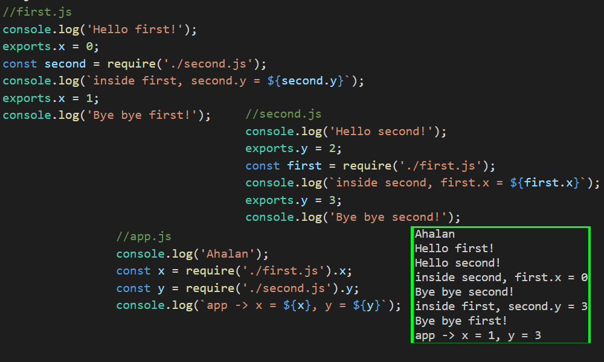

---?image=assets/images/grauman-at-wobi.png

---
# Introduction

Our Facebook Group: 
GRAUMAN- Node.Js at WOBI

WhatsApp:
https://chat.whatsapp.com/HiWZtxYZU0WF0Q9geUFxYD

Tools: 
VSCode, Browser

---

## Node.js @ Wobi

@color[#e49436](GRAUMAN) dev courses for R&D teams
https://www.grauman.co.il

---
#### @color[#e49436](ECMAScript and JavaScript Engines)

- JavaScript came to earth in Netscape - 1993
- They released Mosaic - first Web browser
- 1994 - Netscape was released
  - Internal codename - Mozilla
- May 1995 - Brendan Eich, Netscape, wrote a proposal prototype of a scripting language to be embedded inside Netscape
- Named Mocha, but officialy LiveScript (Netscape 2.0)
- December 1995 - Renamed to JavaScript

---
#### @color[#e49436](ECMAScript and JavaScript Engines)

- Same December '95 - Netscape Enterprise Server
  - LiveWire Pro Web, Server-Side scripting!
- 1996 - Microsoft reversed-engineered Netscape's JS - JScript
  - Internet Explorer 3
  - Used in their IIS servers
- The Browser Wars came
  - "Best viewed in Netscape/Internet Explorer" 
- So before her last breath, Netscape initiated the standard

---
#### @color[#e49436](ECMAScript and JavaScript Engines)

- 1997 - ECMA-262 first standard
- 1998 - ECMAScript 2 
- 1999 - ECMAScript 3
- In the meantime - Blood Shade 
- 2005 - Ajax
  - Big explosion of jQuery, Dojo, MooTools...
- 2009 - ECMAScript 5
- 2015 ECMAScript 6 (ECMAScript 2015 / ES6)
- 2016 ECMAScript 7 (ECMAScript 2016 / ES7)
- 2017 ECMAScript 8 (ECMAScript 2016 / ES8)

---
#### @color[#e49436](Node.js)
- A runtime executes JavaScript outside of a browser
- Written in 2009 - By Ryan Dahl
  - Google's V8, Event Loop, low-level I/O API
- 2010 - NPM
- 2011 Node.js for Windows (Microsoft & Joyent)
- io.js - a fork of node.js
  - keep io.js up to date with latest V8
- 2015 - Node.js v0.12 + io.js v3.3 = Node v4.0

---
#### @color[#e49436](Node.js)

- Is primarily used to build Web servers
- Has numerous modules for various core functionalities
  - File System I/O
  - Networking
  - Buffers & Streams
  - Cryptography

---
#### @color[#e49436](Node.js)

- The biggest difference between Node.js and (ASP/PHP...)
  - Most functions in them block
  - Node.js functions are Non-Blocking

- Has an Event-Driven architecture
  - Asynchronous I/O
  - Optimized throughput
  - Optimized scalability
  - Real-Time web applications

---
#### @color[#e49436](Node.js)

- Event-Driven programming
  - No more threads!
  - using callbacks to signal a task completion

- Uses Google V8 JavaScript engine
  - Extremely fast

---
#### @color[#e49436](V8)

- Released in 2008
- Written in C++
  - Compiles JS to native machine code
- Compiled code ia additionally optimized
  - and re-optimized at runtime
- Consists of Interpreter (Ignition) and optimizing compiler (TurboFan)
  - Replaced Full-Codegen and Crankshaft

---
### @color[#e49436](V8) - JavaScript Engine

#### JavaScript
#### ||
#### C/C++
#### ||
#### Assembly Language
#### ||
#### Machine Language

---
### @color[#e49436](V8)

@size[0.5em](Can be standalone, or be embedded. We can add our own implementations: spit('Whats Up?')) 


---
### @color[#e49436](V8) - JavaScript Engine

Google - V8 (Chrome, Node.js)
Microsoft - Chakra (Edge)
Mozilla - SpiderMonkey (FireFox)

Rhino, JavaScriptCore...

All based on ECMAScript standard

---
#### @color[#e49436](The V8 C++ Side)

Node.js in itself is a C++ implementation of a V8 engine 

Allowing server side programming and networking applications

https://github.com/v8/v8/blob/master/samples/shell.cc

---
#### @color[#e49436](The V8 C++ Side)

If we dive in the source code of v8

We can see HUGE C++ implementations of the ECMAScript standatd

It reads the JS code and convert it to machine code

---
#### @color[#e49436](The V8 C++ Side)

Node Include v8


---
#### @color[#e49436](The V8 C++ Side)

Built-In Json Parser


---
#### @color[#e49436](The V8 C++ Side)

Built-In Boolean


---
#### @color[#e49436](The V8 C++ Side)

Built-In Date


---
#### @color[#e49436](The V8 JavaScript Side)

fs module


---
#### @color[#e49436](The V8 JavaScript Side)

http module


---
#### @color[#e49436](The V8 JavaScript Side)

path module


---
#### @color[#e49436](Node Modules and require)

We saw how to create modules via Closures

Module encapsulates internal data

Module exports a public API

Module is a reusable block of code

---
#### @color[#e49436](Node Modules and require)

CommonJS

Is a project with the goal of specifying an ecosystem for JavaScript outside the browser

NodeJS uses this standard - how code modules should be structured

---
#### @color[#e49436](Node Modules and require)

We use require('module-name');

If it's my module then we add ./ for same directory

require('./my-module');

If it's built-in one we omit the ./

require('fs');

---
#### @color[#e49436](Node Modules and require)

hello.js
```js
var hello = function() {
    console.log('Hello');
}
```
app.js
```js
require('./hello'); //Default to .js files
hello();
```

---
#### @color[#e49436](Node Modules and require)

Exporting our module

hello.js
```js
var hello = function() {
    console.log('Hello');
}
module.exports = hello;
```
app.js
```js
require('./hello');
hello();
```

---
#### @color[#e49436](Node Modules and require)

Module.prototype.require


---
#### @color[#e49436](Node Modules and require)

```js
(function (exports, require, module, __filename, __dirname) { 
  var hello = function(){
    console.log('Hello');
  }

  module.exports = hello;
});
```


---
#### @color[#e49436](Node Modules and require)

- What module loader actually does is 
- running my code inside a wrapper function
- Giving me a module variable (also __dirname)
- And I'm attaching properties to it's export object
- So require returns module.exports

---
#### @color[#e49436](Modules Patterns)

We can export with several techniques

- A single function

```js
module.exports = function() {
    //...
}
```
```js
let func = require('./module');
func();
```

---
#### @color[#e49436](Modules Patterns)

- Add it as a property to exports

```js
module.exports.func = function(){
    //...
}
```
```js
let mod = require('./module');
mod.hello();
```
```js
let hello = require('./module').hello;
hello();
```

---
#### @color[#e49436](Modules Patterns)

- Function Constructor

```js
function Person() {
    this.name = 'Shahar';
    this.sayYourName = function() {
        console.log(`My name is ${this.name}`);
    }
}
module.exports = new Person();
```
```js
let me = require('./person');
me.name = 'Lala'; 
me.sayYourName();
let him = require('./person');
him.sayYourName();
```

---
#### @color[#e49436](Modules Patterns)

- Modules are cached. Further requiring returns the same module

```js
function Person() {
    this.name = 'Shahar';
    this.sayYourName = function() {
        console.log(`My name is ${this.name}`);
    }
}
module.exports = Person;
```
```js
const Person = require('./person');
let me = new Person();
me.name = 'Lala';  me.sayYourName();
let him = new Person();//require('./person');
him.sayYourName();
```

---
#### @color[#e49436](Modules Patterns)

- exports is an object. You can attach it multiple things

```js
var counter = 0; //private!

function Person() {
    this.name = 'Shahar';
    counter++;
    this.sayYourName = function() { 
        return `My name is ${this.name}`; 
    }
    this.counter = function(){ return counter; }
}
function Cat(age){
    this.age = age || 1;
    this.meau = function(){ return 'Feed me simor'; }
}

module.exports.Person = Person;
module.exports.Cat = Cat;
```

---
#### @color[#e49436](Modules Patterns)

- extracting from exports

```js
const things = require('./module');
const Person = things.Person;
const Cat = things.Cat; 
```
Or
```js
const { Person, Cat } = require('./module');
```

---
#### @color[#e49436](Modules Patterns)

- exports using revealing module

```js
var counter = 0; //private!

function Person() {
    this.name = 'Shahar';
    counter++;
    this.sayYourName = function() { 
        return `My name is ${this.name}`; 
    }
}
function Cat(age, owner){
    this.age = age || 1;
    this.meau = function(){ return `Feed me ${owner || 'simor'}`; }
}

module.exports = {
    Person,
    counter: function(){ return counter; },
    createCat: function(owner){
        return new Cat(2, owner);
    }
}
```

---
#### @color[#e49436](Modules Patterns)

- using revealing module

```js
const revealed = require('./module');

let p1 = new revealed.Person();
console.log(p1.sayYourName(), revealed.counter()); 

let kitty = revealed.createCat(p1.name);
console.log(kitty.meau());

```

---
#### @color[#e49436](Modules Patterns)

- Using only *exports* instead of *module.exports*

```js
exports = function Person(name){
    this.name = name;
    this.sayYourName = function() { 
        console.log(`My name is ${this.name}`); 
    }
}
```
```js
var Person = require('./module');

let me = new Person('Shahar');
me.sayYourName();
```
- What do you think?

---
#### @color[#e49436](Modules Patterns)

- Using only *exports* instead of *module.exports*

Remember this?
```js
(function (exports, require, module, __filename, __dirname) { 
  var hello = function(){
    console.log('Hello');
  }

  module.exports = hello;
});
```
exports argument is *module.exports*

They point to the same object

---
#### @color[#e49436](Modules Patterns)

- So you can **add** properties directly to *exports*
  - But not reassign it
- Or just use *module.exports* which is what returned:

```js
Module._load = function(request, parent, isMain) {
  //...
  Module._cache[filename] = module;
  tryModuleLoad(module, filename);
  return module.exports;
};
```

---
#### @color[#e49436](Modules Patterns)

Requiring native modules - without path and extention

```js
const util = require('util');
const readline = require('readline').createInterface({
    input: process.stdin,
    output: process.stdout
});

const quiz = util.format('%d+%f=', 4, 1.98);  
readline.question(quiz, (solution) => {
  console.log(util.format('Your solution to %s%d is: %d', 
                            quiz, 5.98, solution));  
  readline.close();
});
//4+1.98=9.5
//Your solution to 4+1.98=5.98 is: 9.5
```

---
#### @color[#e49436](Modules Patterns) - Circular require call

#### What happens here?


---
#### @color[#e49436](Modules Patterns) - Circular require call

#### What happens here?



---
#### @color[#e49436](Modules Patterns) - Circular require call

- When app.js loads first.js, 
  - Then first.js in turn loads second.js 
- At that point, second.js tries to load first.js 
  - Causing infinite loop @fa[frown-o]
- In order to prevent that - 
  - An **unfinished** copy of first.js exports object is returned to second.js module
  - second.js then finishes loading
    - and its exports object is provided to the first.js module

---
#### @color[#e49436](Modules Patterns) - ES6 modules

- Right now Node not fully supports es6 modules
  - Requires –experimental-modules flag
  - .js should be renamed to .mjs
  - No metavariables such as __dirname and __filename

It's not baked-in yet so don't use it for now


---
#### @color[#e49436](Modules Patterns) - ES6 modules

```js
//my-module.mjs
const X = 2.222;
const Ctor = function(lala){
    this.lala = lala;
}
export { Ctor, X };

//app.js
import { X as constant, Ctor } from './my-module.mjs';
console.log(constant, new Ctor('lala').lala);

//node --experimental-modules .\my-module.mjs
//>2.222 'lala'
```

---
#### @color[#e49436](Console) - dir


---
#### @color[#e49436](Console) - group

- group increases indentation by 2 spaces
- groupEnd decreases indentation by 2 spaces

```js
console.group('a');
console.group('b');
console.groupEnd();
console.group('c');
console.group('d', 'e');
console.groupEnd()
//output
//a
//  b
//  c
//    d e
```

---
#### @color[#e49436](Console) - table

```js
console.table([
        { id: 1, name: 'Shahar' }, 
        { id: 2, name: 'Hanoch' },
        { id: 3, name: 'Gaya' }]);
//output
//┌─────────┬────┬──────────┐
//│ (index) │ id │   name   │
//├─────────┼────┼──────────┤
//│    0    │ 1  │ 'Shahar' │
//│    1    │ 2  │ 'Hanoch' │
//│    2    │ 3  │  'Gaya'  │
//└─────────┴────┴──────────┘
```

---
#### @color[#e49436](Console) - table

```js
function Person(fn, ln) {
    this.firstName = fn; this.lastName = ln;
}
var grauman = {
    mother: new Person("Hadassa", "Grauman"),
    father: new Person("Shahar", "Grauman"),
    daughter: new Person("Gaya", "Grauman"),
};
console.table(grauman);
//output
//┌──────────┬───────────┬───────────┐
//│ (index)  │ firstName │ lastName  │
//├──────────┼───────────┼───────────┤
//│  mother  │ 'Hadassa' │ 'Grauman' │
//│  father  │ 'Shahar'  │ 'Grauman' │
//│ daughter │  'Gaya'   │ 'Grauman' │
//└──────────┴───────────┴───────────┘
```

---
#### @color[#e49436](Console) - time

```js
var i = 0;
function long(){
    let limit = i + 1E7;
    for(; i < limit; i++){}
    return i;
}
console.time('long'); //label
console.timeLog('long', 'elapsed, value ', long());
console.timeLog('long', 'elapsed, value ', long());
console.timeEnd('long');
//output
//long: 32.468ms elapsed, value  10000000
//long: 67.950ms elapsed, value  20000000
//long: 69.131ms
```

---
#### @color[#e49436](Console) - trace

- Outputs the call stack trace


---
#### @color[#e49436](Node Internals)

- Node can be split into 2 parts:
  - The C++ core side (src directory)
    - Reading a file, receive data from internet...
  - The JS core side (lib directory)
    - The API which we use, that interacts with the C++ side
- libuv is in the heart of the C++ core

---
#### @color[#e49436](Node Internals)


---
#### @color[#e49436](Node Internals)

We'll examine it by using the encryption library - *crypto*

Using it's **pbkdf2** method to hash strings, mainly passwords

---
#### @color[#e49436](Node Internals) - Node JS API


---
#### @color[#e49436](Node Internals) - Node JS to CPP


---
#### @color[#e49436](EventEmitter)

##### C++ Function implementation of a callback within the execution context


---
#### @color[#e49436](EventEmitter)

Event emmiter is a fundamental node concept

A lot of it's modules are built on top of this mechanism

The idea is to enable rich Pub/Sub architecture

Modules uses it to enable listeners get notified upon event

---
#### @color[#e49436](EventEmitter)

##### Node C++ Event wrapper implementation (fs)


---
#### @color[#e49436](EventEmitter) - Ex - Pub/Sub

- @size[0.6em](Create a module named *MyEvent* and expose object with 2 methods)
  - @size[0.5em](*on* - will receive 2 arguments: type and listener. The string will be the type of the listeners)
  - @size[0.5em](*emit* - will receive type and invoke all listeners of that type)
- @size[0.6em](Users can require your module and register their listeners)
  - @size[0.5em](For example: myEvent.on('data', myListenerFunc);
- @size[0.6em](When emitting - invoke all listeners)
  - @size[0.5em](For example: myEvent.emit('data')
- @size[0.6em](Enable to pass arguments to the listeners)
- Bonus @size[0.6em](implement *single* - a 1-time listener)

---
#### @color[#e49436](EventEmitter) - inherit

util module has *inherits* method enabling target to get src inheritance

```js
const EventEmitter = require('events');
const util = require('util');

class MyPubSub {
    //...
}
util.inherits(MyPubSub, EventEmitter);
const emitter = new MyPubSub();

emitter.on('msg', () => console.log('Hi event!'));
emitter.emit('msg');
```

---
#### @color[#e49436](EventEmitter) - inherit

Now, with ES6, it is recommended to *extend* EventEmitter rather then using util.inherits

```js
const EventEmitter = require('events');

class MyPubSub extends EventEmitter {
    //...
}
const emitter = new MyPubSub();

emitter.on('msg', () => console.log('Hi event!'));
emitter.emit('msg');
```

---
#### @color[#e49436](Event Loop)


---
#### @color[#e49436](Event Loop)


---
#### @color[#e49436](Streams & Buffers)

---
#### @color[#e49436](Streams & Buffers) - Encoding

---
#### @color[#e49436](Streams & Buffers) - Typed Arrays


---
#### @color[#e49436](Files)


---
#### @color[#e49436](Files) - Ex

Write a function, getting a directory path

The function will print all sub-directories as well the files


---
#### @color[#e49436](Files) - Streams

---
#### @color[#e49436](Files) - Pipes


---
#### @color[#e49436](Web Server) - HTTP, TCP/IP

---
#### @color[#e49436](Web Server) - First Steps

---
#### @color[#e49436](Web Server) - Templates

---
#### @color[#e49436](Web Server) - Performance

---
#### @color[#e49436](Web Server) - JSON

---
#### @color[#e49436](Web Server) - Routing


---
#### @color[#e49436](NPM) - Node Package Manager

---
#### @color[#e49436](NPM) - SemVer

---
#### @color[#e49436](NPM) - package.json


---
#### @color[#e49436](Express) - Web Server made easy


---
#### @color[#e49436](Express) - Routes


---
#### @color[#e49436](Express) - Static Files


---
#### @color[#e49436](Express) - Middlewares

---
#### @color[#e49436](Express) - Template Engine


---
#### @color[#e49436](Express) - Parameters: Querystring/POST

---
#### @color[#e49436](Express) - RESTful API

---
#### @color[#e49436](Express) - MySql


---
#### @color[#e49436](Express) - MongoDB

---
#### @color[#e49436](The V8 C++ Core)


---?image=assets/images/grauman-at-wobi.png

---