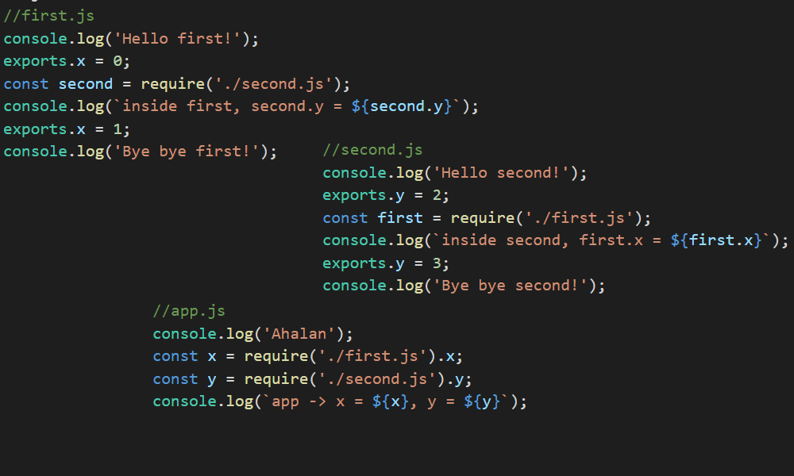
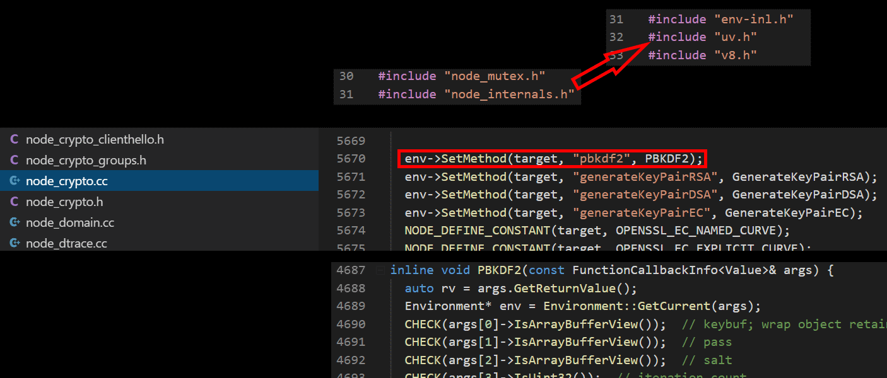

---?image=assets/images/grauman-at-wobi.png

---
# Introduction

Our Facebook Group: 
GRAUMAN- Node.Js at WOBI

WhatsApp:
https://chat.whatsapp.com/HiWZtxYZU0WF0Q9geUFxYD

Tools: 
VSCode, Browser

---

## Node.js @ Wobi

@color[#e49436](GRAUMAN) dev courses for R&D teams
https://www.grauman.co.il

---
#### @color[#e49436](ECMAScript and JavaScript Engines)

- JavaScript came to earth in Netscape - 1993
- They released Mosaic - first Web browser
- 1994 - Netscape was released
  - Internal codename - Mozilla
- May 1995 - Brendan Eich, Netscape, wrote a proposal prototype of a scripting language to be embedded inside Netscape
- Named Mocha, but officialy LiveScript (Netscape 2.0)
- December 1995 - Renamed to JavaScript

---
#### @color[#e49436](ECMAScript and JavaScript Engines)

- Same December '95 - Netscape Enterprise Server
  - LiveWire Pro Web, Server-Side scripting!
- 1996 - Microsoft reversed-engineered Netscape's JS - JScript
  - Internet Explorer 3
  - Used in their IIS servers
- The Browser Wars came
  - "Best viewed in Netscape/Internet Explorer" 
- So before her last breath, Netscape initiated the standard

---
#### @color[#e49436](ECMAScript and JavaScript Engines)

- 1997 - ECMA-262 first standard
- 1998 - ECMAScript 2 
- 1999 - ECMAScript 3
- In the meantime - Blood Shade 
- 2005 - Ajax
  - Big explosion of jQuery, Dojo, MooTools...
- 2009 - ECMAScript 5
- 2015 ECMAScript 6 (ECMAScript 2015 / ES6)
- 2016 ECMAScript 7 (ECMAScript 2016 / ES7)
- 2017 ECMAScript 8 (ECMAScript 2016 / ES8)

---
#### @color[#e49436](Node.js)
- A runtime executes JavaScript outside of a browser
- Written in 2009 - By Ryan Dahl
  - Google's V8, Event Loop, low-level I/O API
- 2010 - NPM
- 2011 Node.js for Windows (Microsoft & Joyent)
- io.js - a fork of node.js
  - keep io.js up to date with latest V8
- 2015 - Node.js v0.12 + io.js v3.3 = Node v4.0

---
#### @color[#e49436](Node.js)

- Is primarily used to build Web servers
- Has numerous modules for various core functionalities
  - File System I/O
  - Networking
  - Buffers & Streams
  - Cryptography

---
#### @color[#e49436](Node.js)

- The biggest difference between Node.js and (ASP/PHP...)
  - Most functions in them block
  - Node.js functions are Non-Blocking

- Has an Event-Driven architecture
  - Asynchronous I/O
  - Optimized throughput
  - Optimized scalability
  - Real-Time web applications

---
#### @color[#e49436](Node.js)

- Event-Driven programming
  - No more threads!
  - using callbacks to signal a task completion

- Uses Google V8 JavaScript engine
  - Extremely fast

---
#### @color[#e49436](V8)

- Released in 2008
- Written in C++
  - Compiles JS to native machine code
- Compiled code ia additionally optimized
  - and re-optimized at runtime
- Consists of Interpreter (Ignition) and optimizing compiler (TurboFan)
  - Replaced Full-Codegen and Crankshaft

---
### @color[#e49436](V8) - JavaScript Engine

#### JavaScript
#### ||
#### C/C++
#### ||
#### Assembly Language
#### ||
#### Machine Language

---
### @color[#e49436](V8)

@size[0.5em](Can be standalone, or be embedded. We can add our own implementations: spit('Whats Up?')) 


---
### @color[#e49436](V8) - JavaScript Engine

Google - V8 (Chrome, Node.js)
Microsoft - Chakra (Edge)
Mozilla - SpiderMonkey (FireFox)

Rhino, JavaScriptCore...

All based on ECMAScript standard

---
#### @color[#e49436](The V8 C++ Side)

Node.js in itself is a C++ implementation of a V8 engine 

Allowing server side programming and networking applications

https://github.com/v8/v8/blob/master/samples/shell.cc

---
#### @color[#e49436](The V8 C++ Side)

If we dive in the source code of v8

We can see HUGE C++ implementations of the ECMAScript standatd

It reads the JS code and convert it to machine code

---
#### @color[#e49436](The V8 C++ Side)

Node Include v8


---
#### @color[#e49436](The V8 C++ Side)

Built-In Json Parser


---
#### @color[#e49436](The V8 C++ Side)

Built-In Boolean


---
#### @color[#e49436](The V8 C++ Side)

Built-In Date


---
#### @color[#e49436](The V8 JavaScript Side)

fs module


---
#### @color[#e49436](The V8 JavaScript Side)

http module


---
#### @color[#e49436](The V8 JavaScript Side)

path module


---
#### @color[#e49436](Node Modules and require)

We saw how to create modules via Closures

Module encapsulates internal data

Module exports a public API

Module is a reusable block of code

---
#### @color[#e49436](Node Modules and require)

CommonJS

Is a project with the goal of specifying an ecosystem for JavaScript outside the browser

NodeJS uses this standard - how code modules should be structured

---
#### @color[#e49436](Node Modules and require)

We use require('module-name');

If it's my module then we add ./ for same directory

require('./my-module');

If it's built-in one we omit the ./

require('fs');

---
#### @color[#e49436](Node Modules and require)

hello.js
```js
var hello = function() {
    console.log('Hello');
}
```
app.js
```js
require('./hello'); //Default to .js files
hello();
```

---
#### @color[#e49436](Node Modules and require)

Exporting our module

hello.js
```js
var hello = function() {
    console.log('Hello');
}
module.exports = hello;
```
app.js
```js
require('./hello');
hello();
```

---
#### @color[#e49436](Node Modules and require)

Module.prototype.require


---
#### @color[#e49436](Node Modules and require)

```js
(function (exports, require, module, __filename, __dirname) { 
  var hello = function(){
    console.log('Hello');
  }

  module.exports = hello;
});
```


---
#### @color[#e49436](Node Modules and require)

- What module loader actually does is 
- running my code inside a wrapper function
- Giving me a module variable (also __dirname)
- And I'm attaching properties to it's export object
- So require returns module.exports

---
#### @color[#e49436](Modules Patterns)

We can export with several techniques

- A single function

```js
module.exports = function() {
    //...
}
```
```js
let func = require('./module');
func();
```

---
#### @color[#e49436](Modules Patterns)

- Add it as a property to exports

```js
module.exports.func = function(){
    //...
}
```
```js
let mod = require('./module');
mod.hello();
```
```js
let hello = require('./module').hello;
hello();
```

---
#### @color[#e49436](Modules Patterns)

- Function Constructor

```js
function Person() {
    this.name = 'Shahar';
    this.sayYourName = function() {
        console.log(`My name is ${this.name}`);
    }
}
module.exports = new Person();
```
```js
let me = require('./person');
me.name = 'Lala'; 
me.sayYourName();
let him = require('./person');
him.sayYourName();
```

---
#### @color[#e49436](Modules Patterns)

- Modules are cached. Further requiring returns the same module

```js
function Person() {
    this.name = 'Shahar';
    this.sayYourName = function() {
        console.log(`My name is ${this.name}`);
    }
}
module.exports = Person;
```
```js
const Person = require('./person');
let me = new Person();
me.name = 'Lala';  me.sayYourName();
let him = new Person();//require('./person');
him.sayYourName();
```

---
#### @color[#e49436](Modules Patterns)

- exports is an object. You can attach it multiple things

```js
var counter = 0; //private!

function Person() {
    this.name = 'Shahar';
    counter++;
    this.sayYourName = function() { 
        return `My name is ${this.name}`; 
    }
    this.counter = function(){ return counter; }
}
function Cat(age){
    this.age = age || 1;
    this.meau = function(){ return 'Feed me simor'; }
}

module.exports.Person = Person;
module.exports.Cat = Cat;
```

---
#### @color[#e49436](Modules Patterns)

- extracting from exports

```js
const things = require('./module');
const Person = things.Person;
const Cat = things.Cat; 
```
Or
```js
const { Person, Cat } = require('./module');
```

---
#### @color[#e49436](Modules Patterns)

- exports using revealing module

```js
var counter = 0; //private!

function Person() {
    this.name = 'Shahar';
    counter++;
    this.sayYourName = function() { 
        return `My name is ${this.name}`; 
    }
}
function Cat(age, owner){
    this.age = age || 1;
    this.meau = function(){ return `Feed me ${owner || 'simor'}`; }
}

module.exports = {
    Person,
    counter: function(){ return counter; },
    createCat: function(owner){
        return new Cat(2, owner);
    }
}
```

---
#### @color[#e49436](Modules Patterns)

- using revealing module

```js
const revealed = require('./module');

let p1 = new revealed.Person();
console.log(p1.sayYourName(), revealed.counter()); 

let kitty = revealed.createCat(p1.name);
console.log(kitty.meau());

```

---
#### @color[#e49436](Modules Patterns)

- Using only *exports* instead of *module.exports*

```js
exports = function Person(name){
    this.name = name;
    this.sayYourName = function() { 
        console.log(`My name is ${this.name}`); 
    }
}
```
```js
var Person = require('./module');

let me = new Person('Shahar');
me.sayYourName();
```
- What do you think?

---
#### @color[#e49436](Modules Patterns)

- Using only *exports* instead of *module.exports*

Remember this?
```js
(function (exports, require, module, __filename, __dirname) { 
  var hello = function(){
    console.log('Hello');
  }

  module.exports = hello;
});
```
exports argument is *module.exports*

They point to the same object

---
#### @color[#e49436](Modules Patterns)

- So you can **add** properties directly to *exports*
  - But not reassign it
- Or just use *module.exports* which is what returned:

```js
Module._load = function(request, parent, isMain) {
  //...
  Module._cache[filename] = module;
  tryModuleLoad(module, filename);
  return module.exports;
};
```

---
#### @color[#e49436](Modules Patterns)

Requiring native modules - without path and extention

```js
const util = require('util');
const readline = require('readline').createInterface({
    input: process.stdin,
    output: process.stdout
});

const quiz = util.format('%d+%f=', 4, 1.98);  
readline.question(quiz, (solution) => {
  console.log(util.format('Your solution to %s%d is: %d', 
                            quiz, 5.98, solution));  
  readline.close();
});
//4+1.98=9.5
//Your solution to 4+1.98=5.98 is: 9.5
```

---
#### @color[#e49436](Modules Patterns) - Circular require call

#### What happens here?



---
#### @color[#e49436](Modules Patterns) - Circular require call

#### What happens here?


---
#### @color[#e49436](Modules Patterns) - Circular require call

- When app.js loads first.js, 
  - Then first.js in turn loads second.js 
- At that point, second.js tries to load first.js 
  - Causing infinite loop @fa[frown-o]
- In order to prevent that - 
  - An **unfinished** copy of first.js exports object is returned to second.js module
  - second.js then finishes loading
    - and its exports object is provided to the first.js module

---
#### @color[#e49436](Modules Patterns) - ES6 modules

- Right now Node not fully supports es6 modules
  - Requires –experimental-modules flag
  - .js should be renamed to .mjs
  - No metavariables such as __dirname and __filename

It's not baked-in yet so don't use it for now


---
#### @color[#e49436](Modules Patterns) - ES6 modules

```js
//my-module.mjs
const X = 2.222;
const Ctor = function(lala){
    this.lala = lala;
}
export { Ctor, X };

//app.js
import { X as constant, Ctor } from './my-module.mjs';
console.log(constant, new Ctor('lala').lala);

//node --experimental-modules .\my-module.mjs
//>2.222 'lala'
```

---
#### @color[#e49436](Console) - dir


---
#### @color[#e49436](Console) - group

- group increases indentation by 2 spaces
- groupEnd decreases indentation by 2 spaces

```js
console.group('a');
console.group('b');
console.groupEnd();
console.group('c');
console.group('d', 'e');
console.groupEnd()
//output
//a
//  b
//  c
//    d e
```

---
#### @color[#e49436](Console) - table

```js
console.table([
        { id: 1, name: 'Shahar' }, 
        { id: 2, name: 'Hanoch' },
        { id: 3, name: 'Gaya' }]);
//output
//┌─────────┬────┬──────────┐
//│ (index) │ id │   name   │
//├─────────┼────┼──────────┤
//│    0    │ 1  │ 'Shahar' │
//│    1    │ 2  │ 'Hanoch' │
//│    2    │ 3  │  'Gaya'  │
//└─────────┴────┴──────────┘
```

---
#### @color[#e49436](Console) - table

```js
function Person(fn, ln) {
    this.firstName = fn; this.lastName = ln;
}
var grauman = {
    mother: new Person("Hadassa", "Grauman"),
    father: new Person("Shahar", "Grauman"),
    daughter: new Person("Gaya", "Grauman"),
};
console.table(grauman);
//output
//┌──────────┬───────────┬───────────┐
//│ (index)  │ firstName │ lastName  │
//├──────────┼───────────┼───────────┤
//│  mother  │ 'Hadassa' │ 'Grauman' │
//│  father  │ 'Shahar'  │ 'Grauman' │
//│ daughter │  'Gaya'   │ 'Grauman' │
//└──────────┴───────────┴───────────┘
```

---
#### @color[#e49436](Console) - time

```js
var i = 0;
function long(){
    let limit = i + 1E7;
    for(; i < limit; i++){}
    return i;
}
console.time('long'); //label
console.timeLog('long', 'elapsed, value ', long());
console.timeLog('long', 'elapsed, value ', long());
console.timeEnd('long');
//output
//long: 32.468ms elapsed, value  10000000
//long: 67.950ms elapsed, value  20000000
//long: 69.131ms
```

---
#### @color[#e49436](Console) - trace

- Outputs the call stack trace


---
#### @color[#e49436](Console) - Command Line Arguments

Using *process.argv* - Array of the node execution, the file executed and the parameters

Or we can install *minimist* with better tooling


---
#### @color[#e49436](Console) - Colors

Installing *chalk* can give us colors to the cmd


---
#### @color[#e49436](Console) - Progress


---
#### @color[#e49436](Node Internals)

- Node can be split into 2 parts:
  - The C++ core side (src directory)
    - Reading a file, receive data from internet...
  - The JS core side (lib directory)
    - The API which we use, that interacts with the C++ side
- libuv is in the heart of the C++ core

---
#### @color[#e49436](Node Internals)


---?image=assets/images/node-intro/libuv.png?position=center&size=60% 80%

@transition[none]

@snap[south-east]
[libuv](https://github.com/libuv/libuv/blob/32cccbc9f00696a4d07fa3b56d8b94ecbebb94a7/src/win/core.c#L506)
@snapend

---
#### @color[#e49436](Node Internals)

We'll examine it by using the encryption library - *crypto*

Using it's **pbkdf2** method to hash strings, mainly passwords

---
#### @color[#e49436](Node Internals) - Node JS API

##### This is the JS API we're using


---
#### @color[#e49436](Node Internals) - Node JS to CPP API

##### This is the actualy CPP, no JS, code



---
#### @color[#e49436](Node Internals) - Node JS to CPP


---
#### @color[#e49436](Node Internals) - Node JS vs. CPP

So whenever we requires modules

Those modules are mapped to the CPP side

We actually delegating our JS code to the CPP code

---
#### @color[#e49436](EventEmitter)

##### C++ Function implementation of a callback within the execution context


---
#### @color[#e49436](EventEmitter)

Event emmiter is a fundamental node concept

A lot of it's modules are built on top of this mechanism

The idea is to enable rich Pub/Sub architecture

Modules uses it to enable listeners get notified upon event

---
#### @color[#e49436](EventEmitter)

##### Node C++ Event wrapper implementation (fs)


---
#### @color[#e49436](EventEmitter) - Ex - Pub/Sub

- @size[0.6em](Create a module named *MyEvent* and expose object with 2 methods)
  - @size[0.5em](*on* - will receive 2 arguments: type and listener. The string will be the type of the listeners)
  - @size[0.5em](*emit* - will receive type and invoke all listeners of that type)
- @size[0.6em](Users can require your module and register their listeners)
  - @size[0.5em](For example: myEvent.on('data', myListenerFunc);
- @size[0.6em](When emitting - invoke all listeners)
  - @size[0.5em](For example: myEvent.emit('data')
- @size[0.6em](Enable to pass arguments to the listeners)
- Bonus @size[0.6em](implement *single* - a 1-time listener)

---
#### @color[#e49436](EventEmitter) - inherit

util module has *inherits* method enabling target to get src inheritance

```js
const EventEmitter = require('events');
const util = require('util');

class MyPubSub {
    //...
}
util.inherits(MyPubSub, EventEmitter);
const emitter = new MyPubSub();

emitter.on('msg', () => console.log('Hi event!'));
emitter.emit('msg');
```

---
#### @color[#e49436](EventEmitter) - inherit

Now, with ES6, it is recommended to *extend* EventEmitter rather then using util.inherits

```js
const EventEmitter = require('events');

class MyPubSub extends EventEmitter {
    //...
}
const emitter = new MyPubSub();

emitter.on('msg', () => console.log('Hi event!'));
emitter.emit('msg');
```

---
#### @color[#e49436](Event Loop)

Each Node program has 1 thread running the Event Loop

It's realy important to even partially understand this

In order to write better code and cope with performance issues

---
#### @color[#e49436](Event Loop)


---
#### @color[#e49436](Event Loop) - node.cc


---
#### @color[#e49436](Event Loop) - High Overview

@ol
- @size[0.6em](The event loop is initialized)
- @size[0.6em](Our code runs entirely and exits to the terminal, unless)
- @size[0.6em](There are task that is need to be ran, in each loop *tick*):
- @size[0.6em](Any pending timers)
- @size[0.6em](Any pending OS task, For example: http server listening)
- @size[0.6em](Any pending long running operations, For example: read file)
- @size[0.6em](Each type of task is managed like in a queue array)
- @size[0.6em](Event loop is paused before next *tick*)
@olend

---
#### @color[#e49436](Event Loop)


---
#### @color[#e49436](Event Loop) - High Overview

@ol
- @size[0.6em](Node checks if any pending timers, setTimeout/setInterval, are ready to be called)
- @size[0.6em](Node checks if any pending OS or long running tasks callbacks should be called)
- @size[0.6em](Pause a little and continue if)
  - @size[0.6em](New pending OS task is done)
  - @size[0.6em](New long running task is done)
  - @size[0.6em](a timer is complete)
- @size[0.6em](Check pending timers, call any setImmediate)
- @size[0.6em](Handle 'close' events, like readStream.on 'close')
@olend

---
#### @color[#e49436](Event Loop) - Single threaded

@ul
- Node is single threaded
  - Is it?
- The event loop runs in a single thread, that's true
- But some of Node's libraries are NOT single threaded
  - They run outside of the event loop
@ulend

---
#### @color[#e49436](Event Loop) - Single threaded

###### Let's check that out and get the feeling by using pbkdf2 hashing function

###### This is a long running operation we can use for our testing

```js
console.time('hash');

crypto.pbkdf2('password', 'nodejs', 1E5, 512, 'sha512', (err, key) => {
    if(!err) {
        console.log(key.toString('hex'));
        console.timeEnd('hash');
    }
})
```
###### It takes ~1.1 second. What happen if we'll run 2 pbkdf2 functions?

---
#### @color[#e49436](Event Loop) - Single threaded

- If we run 2 pbkdf2 functions, it'll take little more than ~1.1
- In my laptop I ran 4 pbkdf2 functions, and they totaly took ~1.5 seconds!
- Running 5 though, took overall of ~2.4 seconds...
- What does it mean?

---
#### @color[#e49436](Event Loop) - libuv Thread Pool

@size[0.6em](The default amount of threads = 4)


@size[0.6em](This can be tuned by setting UV_THREADPOOL_SIZE)

---
#### @color[#e49436](Event Loop) - OS Async functions

@size[0.6em](Not all internals uses thread pool)
@size[0.6em](Things like http requests are delegated to the OS)

@size[0.6em](Take this for example, it takes ~0.250ms)
```js
https.request('https://www.grauman.co.il/', response => {
    response.on('data', cunk => {});
    response.on('end', () => {
        console.timeLog('http-request');
    })
}).end();
```
@size[0.6em](6 requests takes ~0.300ms... No thread pool usage...)

---
#### @color[#e49436](Event Loop) - OS Async functions

- @size[0.6em](Node and libuv don't have any code for handling the low level http requests)
- @size[0.6em](So libuv delegates to the underlying OS and waits for a signal)
  - @size[0.5em](The OS actually does this job and decides whether or not to use threads)
  - @size[0.5em](No blocking of our JS code)
  - @size[0.5em](No Thread Pool usage in this case)

---
#### @color[#e49436](Event Loop) - Quick Summary

@size[0.5em](Note that any required modules are executed as well)


---
#### @color[#e49436](Event Loop) - Summary Ex

So let's do a quick summarize exercise:

BEFORE you run, try to understand what should be the output

Create a small program with the following:

@ol
  - Get some page from the web
  - Read some file from your HD
  - Make 4 pbkdf2 calls 
@olend

---
#### @color[#e49436](Event Loop) - Summary Ex


- @size[0.4em](http will be done by the OS system events)
- @size[0.4em](As soon as it done, it'll be delegated back)
- @size[0.4em](Thread pool: 1 thread assigned to fs, 3 threads to pbkdf2)
- @size[0.4em](fs does 2 roundtrips to the HD)
  - @size[0.4em](It asks for some file statistics, like size)
  - @size[0.4em](Then it reads the file)
    - @size[0.4em](In between, the associated thread is freed)
- @size[0.4em](The 4th pbkdf2 is assigned the free thread)
  - @size[0.4em](All 4 threads assigned to pbkdf2)
- @size[0.4em](1 of them finishes so it delegated back to us)
- @size[0.4em](Then this free one is assigned to the fs, get the statistics and start reading the file because no other job is required)


---
#### @color[#e49436](Streams & Buffers) - Encoding

Everything is binary data!

Each character or symbol is represented by a number

@color[#e49436](Character Set) is the way a character is assigned a number

@color[#e49436](Character Encoding) is how much space we store that number

---
#### @color[#e49436](Streams & Buffers) - Encoding

@color[#e49436](UTF-8) is the dominant encoding on the web

It uses one byte (8 bits) for the first 128 code points

And up to 4 bytes for other characters

The first 128 Unicode code points are the @color[#e49436](ASCII) characters

Which means that @color[#e49436](any ASCII text is also a UTF-8 text)

---
#### @color[#e49436](Streams & Buffers) - Encoding

JavaScript handles well Character Sets like Unicode

But up to recently, it lacks the ability to handle binary data

This is where Node also expands the boundaries of JavaScript

---
#### @color[#e49436](Streams & Buffers) - Buffer

A @color[#e49436](Buffer) is a temporary holding spot, limited size, for data

Data that is being moved from one place to another

---
#### @color[#e49436](Streams & Buffers) - Stream

A @color[#e49436](Stream) is a sequence of data made available over time

Pieces of data that eventually combine into a whole

And may be processed as it streamed

Like stream a movie, instead of downloading it all

---
#### @color[#e49436](Streams & Buffers) - Buffer & Stream

So as the streaming data flows

It fills a buffer

And then processed

Untill the streaming is done

Like the 'buffering' while watching a movie. It buffers some data, process it, and receive more data from the stream...

---
#### @color[#e49436](Streams & Buffers) - Stream

Readable streams like fs.createReadStream, process.stdin

Writable streams like fs.createWriteStream, process.stdout, console

Duplex streams (Readable and Writable) like sockets

Transform streams like gzip

---
#### @color[#e49436](Streams & Buffers) - Buffer

@size[0.5em](chunks fill the buffer and the client eventually get the buffered data)


---
#### @color[#e49436](Streams & Buffers) - Buffer

From the Node API docs


---
#### @color[#e49436](Streams & Buffers) - Typed Arrays

Starting with ES6, JavaScript has Typed Arrays
```js
Int8Array();
Uint8Array();
Uint8ClampedArray();
Int16Array();
Uint16Array();
Int32Array();
Uint32Array();
Float32Array();
Float64Array();
```
@size[0.4em](Now JavaScript has mechanism for reading or manipulating streams of binary data)

---
#### @color[#e49436](Streams & Buffers) - Typed Arrays

You rarely be using raw Buffers nor Typed Arrays

They are being used by node, mainly with fs and http


---
#### @color[#e49436](Files) - fs module readFileSync

We'll start by using readFileSync. It returns a Buffer 


@size[0.4em](It's intentionaly named ...Sync, because it's blocking)

---
#### @color[#e49436](Files) - fs module readFile

@size[0.5em](readFile, on the other hand, is async. You pass it a callback to be called when data has been fully read)


---
#### @color[#e49436](Files) - fs module readFile

```js
fs.readFile('lorem-ipsum.txt', (err, data) => {
    console.log(data); //<Buffer 4c 6f 72 ... >    
    console.log(data.toString()); //Lorem inpsum...
});
```
---
#### @color[#e49436](Files) - fs module

But what happens if the file is big?

Although fs uses buffer asynchronously, it still consuming memory

And what if many users are reading this file?

You can end up consuming a lot of memory

---
#### @color[#e49436](Files) - Streams again

Streams are a pattern that convert big operations into manageable chunks

Data is usualy split into chunks and streamed

A chunk is a piece of data being sent through a stream

How does Stream actualy stream chunks?

---
#### @color[#e49436](Files) - Streams again


---
#### @color[#e49436](Files) - Stream types

So every Stream *is* EventEmitter. It has the *on* and *emit* events

We have several types of Streams such as 
- Readable - reading only 
- Writable - writing only
- Duplex - read and write
  - Transform - change the data as it's written

---
#### @color[#e49436](Files) - Streams types


---
#### @color[#e49436](Files) - ReadableStream

Let's take for example the Readable stream.

It inherits from Stream, which inherits from EventEmitter, making it able to emit or listen to events 

@size[0.5em](But those streams are abstract) 

@size[0.5em](Here is 1 place where ReadStream is created in fs:)
```js
function createReadStream(path, options) {
  lazyLoadStreams();
  return new ReadStream(path, options);
}
```

---
#### @color[#e49436](Files) - ReadableStream

```js
const readable = fs.createReadStream('lorem-ipsum.txt');

readable.on('data', chunk => {
    console.log(chunk.length);
});
//-> 28585
```

@size[0.5em](The default buffer size is 64K, so if I read a larger file, let say 85K, then it'll be read in 2 chunks)
```js
//65536
//20227
```

---
#### @color[#e49436](Files) - ReadableStream

@size[0.5em](We can pass options like encoding and the buffer size)
```js
readable = fs.createReadStream('lorem-ipsum.txt', { 
    encoding: 'utf8', 
    highWaterMark: 16 * 1024 //16K
}).on('data', chunk => {
    console.log(chunk.length);
});
//16384
//16384
//16384
//16384
//16384
//3843
```

---
#### @color[#e49436](Files) - Readable to WritableStream

@size[0.5em](So it's easy to write those chunk to a Writable Stream)

```js
const writable = fs.createWriteStream('output-lorem.txt');

const readable = fs.createReadStream('lorem-ipsum.txt', { 
    encoding: 'utf8', 
    highWaterMark: 16 * 1024 //16K
}).on('data', chunk => {
    console.log(chunk.length);
    writable.write(chunk);
});
```
@size[0.5em](We can deal with a large files with relatively small buffers!)

---
#### @color[#e49436](Files) - Backpressure

@size[0.6em](Writer signals when it's available to further consume the next chunk)

@size[0.6em](What happens if the writer is slower than the reader?)

@size[0.6em](Perhaps the writer is a Transform which process each chunk)

@size[0.6em](This could lead the reader to keep storing the next datas, bloating the process memory)

---
#### @color[#e49436](Files) - Piping Streams

@size[0.6em](We can pipe data from a Readable stream to a Writable stream)

@size[0.6em](It is a connection we do between 2 streams)

@size[0.6em](Reading from a Readable and piping to a Writable)

@size[0.6em](If the Writable is also a Redable)

@size[0.6em](We can continue piping)

@size[0.6em](Piping handles the Backpressure!)

---
#### @color[#e49436](Files) - Piping Streams


---
#### @color[#e49436](Files) - Piping Streams

```js
const writable = fs.createWriteStream('output.txt');
const readable = fs.createReadStream('file.txt', { 
    encoding: 'utf8', 
    highWaterMark: 16 * 1024 //16K
});
//When pipe is connected, the data is streaming
readable.pipe(writable).on('close', () => {
    console.log(writable.bytesWritten);
});
```
---
#### @color[#e49436](Files) - Piping Streams

@size[0.5em](*process.stdin* is readable)
@size[0.5em](*process.stdout* is writable)

```js
process.stdin.pipe(process.stdout);
```

@size[0.5em](the *request* of the http module is readable)
@size[0.5em](the *response* of the http module is writable)

---
#### @color[#e49436](Files) - Piping & Transform

```js
const fs = require('fs'),
      zlib = require('zlib');

const gzip = zlib.createGzip();
const writable = fs.createWriteStream('file.txt.gz');

fs.createReadStream('file.txt')
    .pipe(gzip)
    .pipe(writable)
    .on('close', () => console.log('Finished'));
```

---
#### @color[#e49436](Files) - Piping & Transform

3rd party libs such as *through2* or *highland* can simplify things

through2 can be passed a function with the same signature as transform

And it returns a Transform stream

Which can be piped through

---
#### @color[#e49436](Files) - Piping & Transform


Short Ex - 
@ol
- replace 'fun' with 😃, hard with 😱, sun with ☀️, gun with 🔫  
@olend
---
#### @color[#e49436](Files) - Ex

Write a program that print a directory content

The program will print all sub-directories as well the files


---
#### @color[#e49436](Files) - Streams

---
#### @color[#e49436](Files) - Pipes


---
#### @color[#e49436](Web Server) - HTTP, TCP/IP

---
#### @color[#e49436](Web Server) - First Steps

---
#### @color[#e49436](Web Server) - Templates

---
#### @color[#e49436](Web Server) - Performance

---
#### @color[#e49436](Web Server) - JSON

---
#### @color[#e49436](Web Server) - Routing


---
#### @color[#e49436](NPM) - Node Package Manager

---
#### @color[#e49436](NPM) - SemVer

---
#### @color[#e49436](NPM) - package.json


---
#### @color[#e49436](Express) - Web Server made easy


---
#### @color[#e49436](Express) - Routes


---
#### @color[#e49436](Express) - Static Files


---
#### @color[#e49436](Express) - Middlewares

---
#### @color[#e49436](Express) - Template Engine


---
#### @color[#e49436](Express) - Parameters: Querystring/POST

---
#### @color[#e49436](Express) - RESTful API

---
#### @color[#e49436](Express) - MySql


---
#### @color[#e49436](Express) - MongoDB

---
#### @color[#e49436](The V8 C++ Core)


---?image=assets/images/grauman-at-wobi.png

---